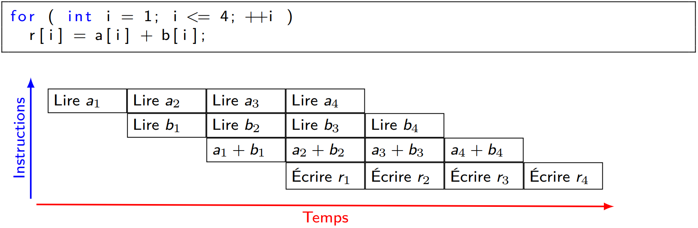
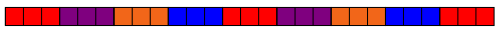
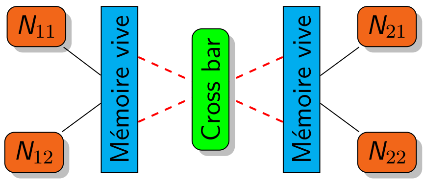

## Architectures parallèles

### Architecture des ordinateurs parallèles

- **SISD** : Simple Instruction, Simple Data : architecture classique, programmation séquentielle classique

- **SIMD** : Simple Instruction, Multiple Data : Une seule instruction exécutée à la fois mais appliquée sur plusieurs données simultanément : GPGPU, unités AVX et SSE.

  - technique de masque pour les sauts conditionnels :

    ex. 

    ```C++
    if (a[i]>0) b[i] = c[i];
    else b[i] = d[i];
    //==>
    mask[i] = (a[i]>0);
    b[i] = mask[i]*c[i] + (1-mask[i])*d[i];
    ```

    

- **MISD** : Multiple Instruction, Simple Data : plusieurs instructions exécutées traitant simultanément une seule donnée : architectures pipelines associées aux registres vectoriels.

  - ex. 

- **MIMD** : Multiple Instruction, Multiple Data : plusieurs instructions qui traitent chacune des données différentes : ordinateurs multi-cœurs, calculateurs à mémoires distribuées.

### Mémoire partagée, mémoire distribuée et mémoire NUMA

#### mémoire partagée

- La mémoire vive entrelacée

  - Nombre de voies : Nombre de mémoire qui sont entrelacées;

  - Largeur des voies : Nombre d’octets entre deux voies successives;  

    ex. une mémoire entrelacée à quatre voies de largeur 3 : Un carré = un octet 

  

- Une mémoire cache hiérarchique

#### principe de mémoire distribuée

- **nœud de calcul** : l’ensemble unité de calcul + mémoire vive. Chaque unité de calcul possède sa propre mémoire vive.
- 

#### Architecture NUMA

- Machine contenant des nœuds de calcul;

- Chaque nœud contient plusieurs unités de calcul;

- Les nœuds de calcul sont reliés par un crossbar - QPI ( Quick Path Interconnect );

- Du point de vue programmeur, la mémoire est partagée;

- Mais les temps d’accès aux données varient fortement selon qu’une unité de calcul accède à une donnée se trouvant sur son nœud de calcul ou sur un nœud de calcul distant.  

  

### Travaux dirigés n°1 - MPI

