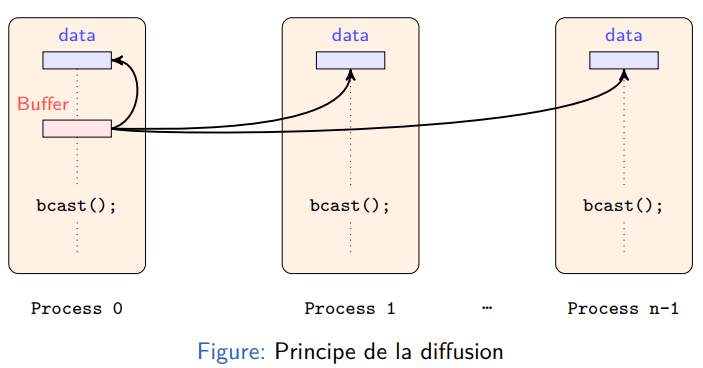
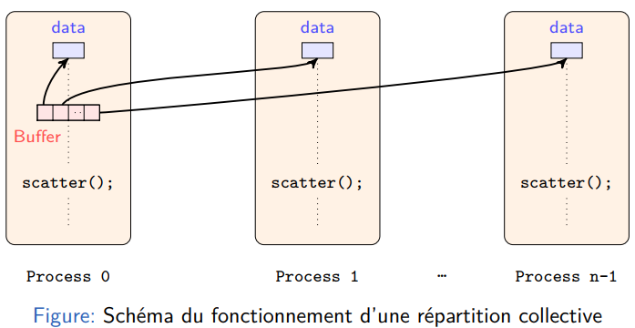
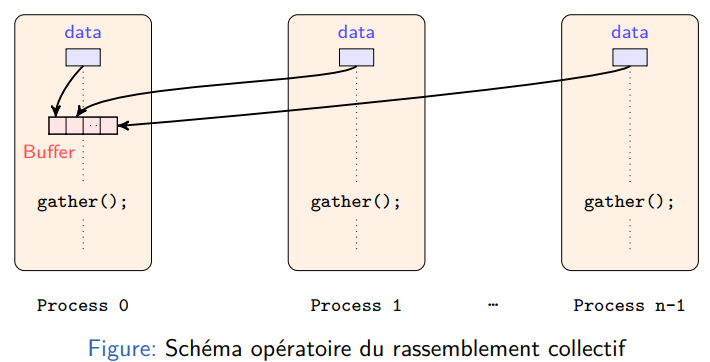
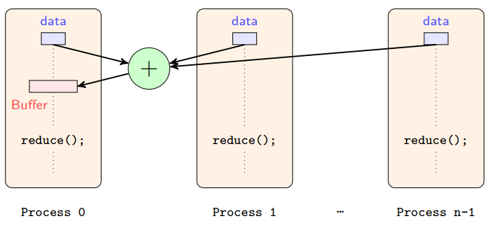
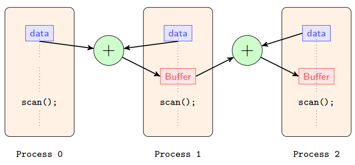

# Calcul parallèle distribué  

## Architecture des calculateurs à mémoire distribuée  

Définition: **Nœud de calcul** - Une ou plusieurs unités de calculs et une mémoire vive;

Définition: **Calculateur à mémoire distribuée** - Calculateur contenant plusieurs nœuds de calcul pouvant communiqués entre eux au travers d’un bus spécialisé ou un réseau éthernet.  

## Programmation sur calculateur parallèle à mémoire distribuée  

### Topologie d’un réseau  

Définition: **Distance entre deux nœuds** - Nombre minimal de nœuds intermédiaire par lesquels doit passer le message; 

Définition: **Diamètre d’un réseau** - Distance maximale possible entre deux nœuds du calculateur parallèle.  

- ex : Réseau hypercube - Diamètre d’un réseau = Dimension du cube

### Modèles de programmation  

- **SPSD** (Simple Program Simple Data ) : programmation séquentielle classique
- **SPMD** ( Simple Program Multiple Data ) : Même programme exécuté sur chaque nœud, Données différentes
- **MPMD** ( Multiple Program Multiple Data ) : Chaque nœud exécute un programme différent avec des données différentes  

## Communications collectives  

- Envoi/Réception synchrone (slides : p.16)
- Envoi/Réception asynchrone (slides : p.20)

- Interblocage (deadlock) (slides : p.18) : tous les processus envoient message bloquant à un autre processus avant d’effectuer une réception; Ou cas symétrique où tous les processus attendent un message en réception avant d’effectuer un envoi. 

| **Broadcast** |  |
| :-----------: | :------------------: |
|  **Scatter**  |    |
|  **Gather**   |     |
|  **reduce**   |     |
|   **Scan**    |       |

## Mesures de performances

- Accélération (speedup)  (slides : p.33)
- Loi d’Amdahl
- Loi de Gustafson
- Efficacité
- Coût d’un calcul parallèle
- Scalabilité

## Optimisation d’un code parallèle

- Équilibrage des charges : Tous les processus mettent le même temps de traitement de leurs données.
- Équilibrage dynamique des charges : **Squelette algorithme maître–esclave** (important)
- Granularité parallèle : Rapport du nombre d’opérations effectuées sur le nombre de données échangés