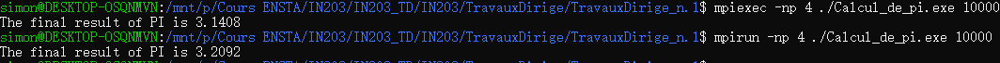

# TD de IN203
## Introduction
Prénom:  Zhuoye 
Nom:  YING 
Groupe:  2  

## TD 1

- Resultat de Calcule_de_pi.exe : la difference entre mpiexec et mpirun

  

- `2^n` : `1<<n`
- 

## TD 2

- Les question 1 et 2 ?
- Temps total ? 
- realloc pour vector : `std::vector<int>(W*H).swap(pixels);`
- MPI_Recv(..., MPI_Status& status) : `status.MPI_TAG`, `status.MPI_SOURCE`
- `default`, `delete`
